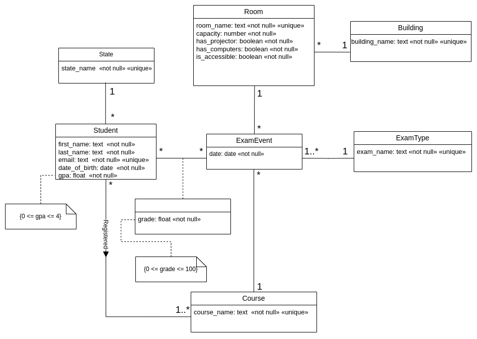

# MECD Database Project

## UML designed For the grades CSV

## Relational Model from UML
1. Student (<u>**student_id**</u>, first_name [NN], last_name [NN], email [NN][UK], date_of_birth, [NN], gpa [NN], #state_id -> State)

2. State (<u>**state_id**</u>, state_name [NN])

3. Course (<u>**course_id**</u>, course_name [NN][UK])

4. ExamType (<u>**exam_type_id**</u>, exam_name [NN][UK])

5. Building (<u>**building_id**</u>, building_name [NN][UK])

6. Room (<u>**room_id**</u>, room_name [NN][UK], #building_id -> Building [NN], has_projector [NN], has_computers [NN], is_accessible [NN])

7. ExamEvent (<u>**exam_event_id**</u>, date [NN], #exam_type_id -> ExamType [NN], 
	   #course_id -> Course [NN], #room_id -> Room [NN])

8. Enrollment (<u>**#student_id -> Student**</u>, <u>**#course_id -> Course**</u>)

9. Assessment (<u>**#student_id -> Student**</u>, <u>**#exam_event_id -> ExamEvent**</u>, grade [NN])

## Tables creation script
[Click here](grades.sql) to check out the creation script for the database tables over the **grades** schema.

## Tables insertion examples without Python automation
[Click here](insert_examples.sql) to have some examples to populate grades' tables via SQL script.

